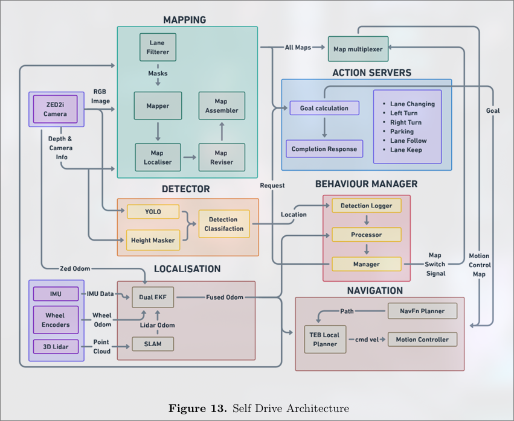
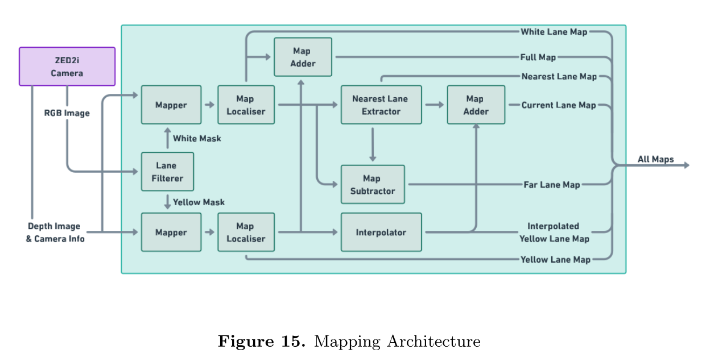

# self-drive-ws

Software stack for 32nd IGVC (Intelligent Ground Vehicle Competition) Self-Drive Challenge (Team: Project MANAS).

## System Architecture Overview

Full Technical Design Report available [here](https://drive.google.com/drive/folders/1Wkw5NK7srPLMnpGPInIUA12y14CPr3CD).




## Setup

This setup is typically performed on Ubuntu 22.04 LTS.

### Install prerequisite libraries
1. ROS2 Humble
2. Other relevant apt and python packages 
```bash
./libinstall.sh
```
3. Docker

### Setup ROS1 bridge
1. Download the docker images from [here]().
2. Load the docker images.
```bash
docker load < ros_noetic.tar.gz
docker load < ros1_bridge_builder.tar.gz
```
3. Install ``nvidia-container-toolkit``
```
sudo apt install nvidia-container-toolkit
sudo systemctl restart docker
```
4. Setup ros1-bridge
```
cd ~ && docker run --network host --rm ros-humble-ros1-bridge-builder | tar xvzf -
echo "source ~/ros-humble-ros1-bridge/install/local_setup.bash" >> ~/.bashrc
source ~/.bashrc
```
5. To build ROS1 packages, 
```bash
cd ros1-bridge && docker run -it \\
    --env=\"QT_X11_NO_MITSHM=1\" \\
    --volume=\"\$(pwd):/dvolume\" \\
    --privileged \\
    --device=/dev/ttyACM0 \\
    --device=/dev \\
    --gpus device=0 \\
    -e DISPLAY=:0 \\
    -v /tmp/.X11-unix:/tmp/.X11-unix \\
    --network host \\
    -e ROS_MASTER_URI=http://localhost:11311 \\
    -e \"NVIDIA_DRIVER_CAPABILITIES=all\" \\
    -e \"NVIDIA_VISIBLE_DEVICES=all\" \\
    -e \"CONTAINER_COMMANDS=$CONTAINER_CMDS\" \\
    ros:noetic \\
    /dvolume/container_init.sh
```
Then, inside the container,
```bash
cd dvolume/
catkin_make
```

### Build
To build and source only packages relevant for simulation-testing, 
```
source simbuild.sh
```
To build and source all packages, 
```
source irlbuild.sh
```

### Configure
To set simulation mode, choose detection mode or specify behaviour code, edit `src/launcher/config/config.yaml`. Then,
```bash
colcon build --packages-select launcher
```

### Run
If testing in simulation,
```bash
ros2 launch launcher main.launch.py
```
Otherwise,
```bash
BEHAVIOUR_CODE=0  # Set behaviour code as per requirement
./launch.sh $BEHAVIOUR_CODE # To terminate tmux session, run ./terminate.sh
```
